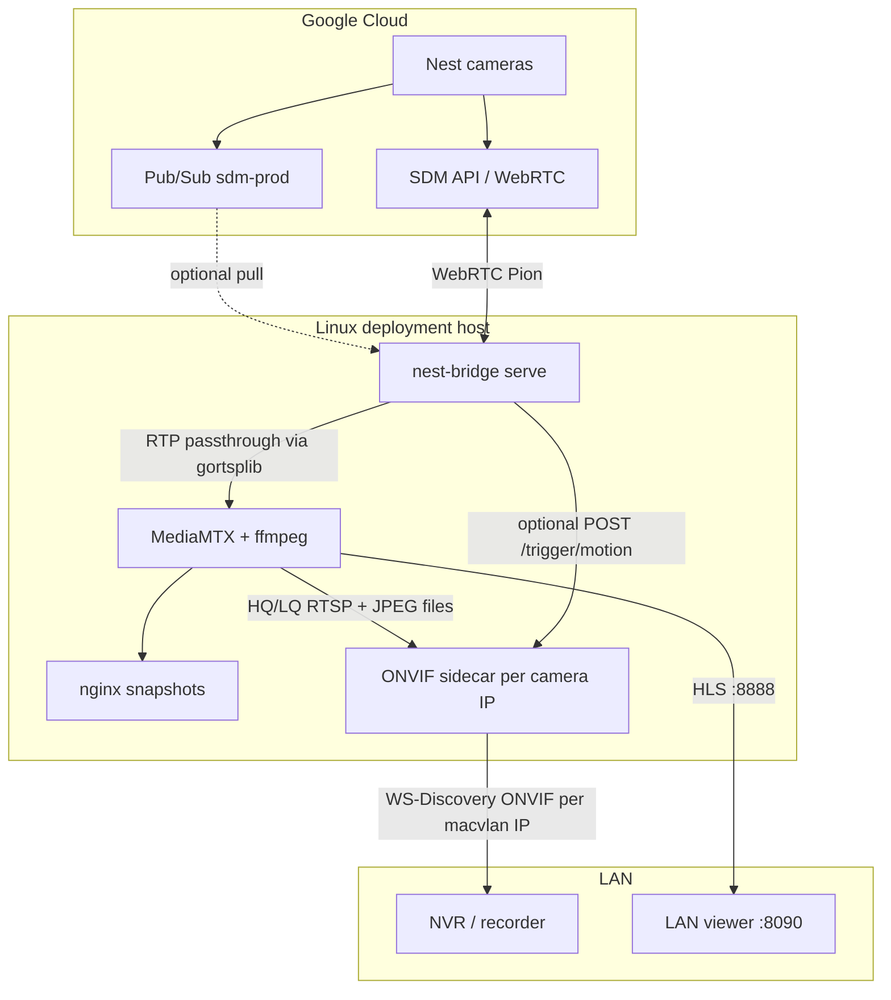

# nest-to-ONVIF

A Go control plane that pulls live video from Google Nest cameras through the official
Smart Device Management (SDM) API and republishes each one as a virtual ONVIF camera on
your LAN. Any recorder that adopts third-party ONVIF devices can use them like ordinary
IP cameras.

Live SDM access does not require Nest Aware. Google charges a one-time **$5 USD**
Device Access registration fee. 

## What it provides

Each configured camera becomes a distinct ONVIF device (unique MAC and IP) with RTSP
streams, JPEG snapshots, optional AAC audio, and an optional ONVIF Events service.

| Layer | Role |
| --- | --- |
| **Control plane** (`nest-bridge serve`) | OAuth, SDM/WebRTC sessions, RTP → RTSP, optional LAN viewer (`:8090`) |
| **Media plane** (MediaMTX + ffmpeg) | HQ/LQ H.264, AAC transcode, snapshots, HLS for the viewer |
| **ONVIF sidecar** | WS-Discovery, profiles, RTSP proxy, Events service |
| **Events (optional)** | Pub/Sub → per-camera tracker → ONVIF `/trigger/motion` → three ONVIF motion topics |

## Documentation

| Doc | Contents |
| --- | --- |
| [**SETUP.md**](docs/SETUP.md) | VM, host scripts, setup wizard, deploy, live view, adoption |
| [**GOOGLE-CLOUD.md**](docs/GOOGLE-CLOUD.md) | Cloud project, OAuth, Device Access, Pub/Sub, IAM, `gcloud` checks |
| [**EVENTS.md**](docs/EVENTS.md) | Optional Nest detections → ONVIF motion (`events.onvif`) |
| [**STREAMING.md**](docs/STREAMING.md) | Continuous streaming, session renewal, wire-power requirement |

**Quick start:** provision a Linux VM → [`docs/SETUP.md`](docs/SETUP.md) → run
`./bin/nest-bridge setup` (SSH tunnel `8190` to the VM) → adopt cameras by IP in your
NVR.

## ONVIF client compatibility

Profile S: H.264, optional AAC, HQ + LQ profiles, JPEG snapshots, ONVIF Events. Clients
vary in what they use.

| Client | Video | Audio | Snapshots | HQ + LQ | ONVIF motion (`events.onvif` + per-camera `event:`) | Notes |
| --- | --- | --- | --- | --- | --- | --- |
| **UniFi Protect 7.x** | H.264 | AAC when `audio: true` | JPEG | Both held open | `MotionAlarm`, `CellMotionDetector`, `MotionRegionDetector` | May also detect motion from RTSP analysis; see [EVENTS.md](docs/EVENTS.md) |
| **Blue Iris** | H.264 | AAC when `audio: true` | JPEG | Usually one | Often honoured | |
| **Home Assistant** | H.264 | AAC when `audio: true` | JPEG | Usually one | Often honoured | |
| **Synology SS** | H.264 | AAC when `audio: true` | JPEG | Varies | Varies | |
| **Scrypted** | H.264 | AAC when `audio: true` | JPEG | Varies | Varies | May use RTSP URL directly |
| **Agent DVR** | H.264 | AAC when `audio: true` | JPEG | Varies | Often honoured | |
| **ZoneMinder** | H.264 | AAC when `audio: true` | JPEG | Varies | Varies | |
| **Frigate** | — | — | — | — | — | Use RTSP (`rtsp://<host>:8554/<camera>-hq`), not ONVIF adoption |

Adopt by **IP address** (all cameras share the `nest-bridge Nest Virtual Camera` label).
Each camera needs a unique `cameras[].onvif` MAC and IP; changing either after adoption
presents a new device. Requires a **Linux host** with macvlan — not Docker Desktop on
macOS/Windows.

Nest delivers Opus over WebRTC; the bridge transcodes to **AAC** for ONVIF when
`audio: true`. Two-way talk is not supported.

## Requirements

- Go 1.27+ (to build from source)
- Consumer Google account (not Workspace / Advanced Protection)
- Google Cloud project + Device Access project ($5 one-time)
- **Wire-powered** Nest cameras (see [continuous streaming](docs/STREAMING.md))
- Internet between camera, Google, and the bridge host
- **Linux** deployment host (macvlan + host networking)

Pub/Sub credentials are required only when [`events.onvif`](docs/EVENTS.md) is enabled
on at least one camera. See [EVENTS.md](docs/EVENTS.md) for the global switch and
per-camera `event:` blocks.

nest-bridge `serve` opens a **24/7** SDM/WebRTC session per camera and renews it with
Google's `ExtendWebRtcStream` API. **Battery-powered cameras are not supported** for
that model — Google does not extend streams on battery, and battery doorbells cannot
extend at all. Use permanently mains-powered devices only.

## Bandwidth

Nest video is cloud-routed. A measured doorbell sample was ~1.33 Mbps sustained (~430 GB/month
per camera). Six cameras can exceed **2.5 TB/month** on WAN. See [known constraints](#known-constraints).

## Known constraints

| Constraint | Consequence |
| --- | --- |
| Continuous streaming only | `serve` holds one live session per camera; not for on-demand viewing |
| Wire power required | Battery cameras unsupported; see [STREAMING.md](docs/STREAMING.md) |
| Cloud-routed video | WAN use; stops on internet outage |
| WebRTC sessions ~5 min | Renewed via `ExtendWebRtcStream`, not full reconnect each time |
| SDM quota (10 QPM global) | Scheduler prioritises renewals |
| One MAC + IP per virtual camera | Linux macvlan required |
| HQ + LQ often both held open | Budget LAN and WAN bandwidth |
| Recorder camera limits | Each virtual camera counts |

## Architecture

nest-to-ONVIF sits between Google's cloud APIs and a conventional ONVIF NVR on your
LAN. Video is always cloud-routed (Nest → Google → bridge → LAN). The bridge does not
touch cameras directly — it uses the official [Smart Device Management API](https://developers.google.com/nest/device-access).

### End-to-end flow

### Deployment topology

Everything runs on a **single Linux VM** on the same subnet as your recorder. Docker
Compose starts four services; two use **host networking** because ONVIF identity is
tied to per-camera LAN addresses.

| Container | Image / build | Network | Role |
| --- | --- | --- | --- |
| **bridge** | `nest-bridge:local` (this repo) | host | `nest-bridge serve` — SDM sessions, RTSP publish, optional Pub/Sub + viewer |
| **mediamtx** | [bluenviron/mediamtx](https://github.com/bluenviron/mediamtx) | ports on host IP + loopback | RTSP hub, HLS (`:8888`), ffmpeg transcode hooks |
| **snapshots** | nginx | ports on host IP + loopback | Serves JPEGs written by MediaMTX |
| **onvif** | Patched [emberstonel/onvif-virtual-camera](https://github.com/emberstonel/onvif-virtual-camera) | **host** + macvlan | One virtual ONVIF device per camera IP |

**macvlan** (`deploy/macvlan-setup.sh`) creates `onvif-1` … `onvif-N` interfaces on the
host, each with the MAC and IP from `config.yaml`. The ONVIF container binds HTTP/RTSP on
those addresses so WS-Discovery and adoption see distinct devices — not one multi-head
camera. MediaMTX and nginx bind only to the **host IP** and `127.0.0.1`, not `0.0.0.0`,
so they do not steal ports on camera macvlan IPs.

### Video path (always on)

1. **OAuth** — `nest-bridge auth` / setup wizard stores refresh tokens in `tokens.json`.
2. **Session** (`internal/session`) — per camera, opens a [Pion](https://github.com/pion/webrtc)
   WebRTC peer to Google via `GenerateWebRtcStream`, renews with `ExtendWebRtcStream`
   (~60% of the 5-minute lifetime), reconnects only on failure. See [STREAMING.md](docs/STREAMING.md).
3. **Publish** (`internal/media`) — RTP H.264 (+ Opus if present) is **forwarded without
   re-encoding** to MediaMTX on `rtsp://127.0.0.1:8554/<camera-path>` via
   [gortsplib](https://github.com/bluenviron/gortsplib).
4. **Transcode** (`internal/mediamtx` → `mediamtx.yml`) — when the raw path goes live,
   MediaMTX starts one ffmpeg process per camera that produces:
   - **HQ** path — H.264 copy + Opus → AAC (for ONVIF clients that reject Opus)
   - **LQ** path — scaled H.264 + AAC (many recorders hold both HQ and LQ open)
   - **JPEG snapshots** — periodic stills into the shared `snapshots` volume
5. **ONVIF** (`internal/onvif` → `onvif.yml`) — generated config tells the sidecar to
   proxy `rtsp://<camera-ip>:8554/<camera>-hq` and `-lq`, and snapshot URLs via
   `http://127.0.0.1:8080/<camera>.jpg`. Recorders adopt by **camera IP** and key
   identity off the configured **MAC**.

The **scheduler** (`internal/sdm` quota: 10 QPM global) serialises SDM API calls across
all cameras so renewals are not starved by parallel connects.

### Optional events path

Disabled by default. Requires `events.onvif: true`, Pub/Sub credentials, and a per-camera
`event:` block. Full detail in [EVENTS.md](docs/EVENTS.md).

1. **Pub/Sub** (`internal/events/subscriber`) — pulls SDM device events from your Cloud
   subscription (separate service-account key; the OAuth token cannot read Pub/Sub).
2. **Tracker** (`internal/events/motion`) — collapses `CameraMotion`, `CameraPerson`, and
   `DoorbellChime` pulses into one motion window per camera (`linger`, default 60s).
3. **Trigger** — on/off edges POST to `http://<camera-ip>/trigger/motion`.
4. **ONVIF Events** (`deploy/onvif/events-service.js`, from
   [jwallen2139/onvif-events-bridge](https://github.com/jwallen2139/onvif-events-bridge))
   — fans each edge out to three standard ONVIF motion topics:
   `MotionAlarm`, `CellMotionDetector`, and `MotionRegionDetector`.

### LAN viewer (optional)

`internal/viewer` serves a small web UI on `:8090` (configurable). Camera list comes from
`config.yaml`; tiles play MediaMTX HLS on port `8888`. Motion edges from the event bus
feed SSE when events are enabled.

### Setup and config generation

| Component | What we built |
| --- | --- |
| **Setup wizard** (`internal/setup`, `nest-bridge setup`) | Web UI on `:8190` — host checks, Google OAuth, camera/MAC/IP assignment, deploy |
| **Config generators** (`onvif-config`, `mediamtx-config`) | Render `deploy/onvif.yml` and `deploy/mediamtx.yml` from `config.yaml` so paths, IPs, and stream URIs cannot drift |
| **Host scripts** (`bin/`) | `setup-host`, `setup-macvlan`, `setup-deploy`, Docker install, bridge build |
| **Deploy** (`internal/setup/deploy.go`) | Writes config, patches compose host IP, installs credentials, runs macvlan + `docker compose up` |

`config.yaml` is the single source of truth for camera names, device IDs, ONVIF MAC/IP,
audio, and per-camera event forwarding.

### Repository map

| Path | Role |
| --- | --- |
| `cmd/nest-bridge/` | CLI entrypoint |
| `internal/cli/` | `auth`, `devices`, `stream`, `serve`, `setup`, config generators |
| `internal/sdm/` | OAuth, SDM REST client, stream commands |
| `internal/session/` | WebRTC lifecycle, renewal loop, per-camera state machine |
| `internal/media/` | RTP → RTSP publisher (gortsplib) |
| `internal/mediamtx/`, `internal/onvif/` | Generated sidecar YAML |
| `internal/events/` | Pub/Sub pull, motion tracker, ONVIF trigger dispatch |
| `internal/viewer/` | Embedded LAN viewer |
| `internal/supervisor/` | Restarts per-camera runners on failure |
| `deploy/` | Docker Compose, ONVIF Dockerfile + patches, macvlan script |

## Acknowledgements

This project builds on several open-source and community efforts:

| Project | Role |
| --- | --- |
| [Den Delimarsky — recording Nest video without Nest Aware](https://den.dev/blog/free-nest-video-recording/) | Early research that motivated SDM-based recording |
| [Google Nest Device Access / SDM API](https://developers.google.com/nest/device-access) | Official OAuth, WebRTC streaming, and Pub/Sub device events |
| [daniela-hase/onvif-server](https://github.com/daniela-hase/onvif-server) | Original virtual ONVIF camera for UniFi Protect |
| [emberstonel/onvif-virtual-camera](https://github.com/emberstonel/onvif-virtual-camera) | Fork used as the ONVIF sidecar base image (patched for Events + AAC) |
| [jwallen2139/onvif-events-bridge](https://github.com/jwallen2139/onvif-events-bridge) | ONVIF Events WS-PullPoint service and motion-topic prior art (MIT) |
| [bluenviron/mediamtx](https://github.com/bluenviron/mediamtx) | RTSP server, HLS, ffmpeg transcode, snapshot paths |
| [bluenviron/gortsplib](https://github.com/bluenviron/gortsplib) | RTSP publishing from the Go bridge |
| [Pion WebRTC](https://github.com/pion/webrtc) | WebRTC peer connection and RTP receive |
| [nginx](https://nginx.org/) | Snapshot JPEG serving in the `snapshots` container |

Current Nest hardware is WebRTC-only; this project uses Google's official SDM API rather
than reverse-engineered stream URLs.

## Disclaimer

Unaffiliated with Google. SDM behaviour may change without notice. Not suitable for
life-safety or critical monitoring.
