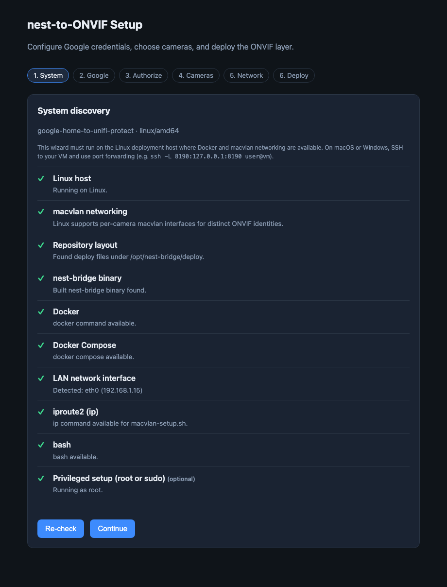
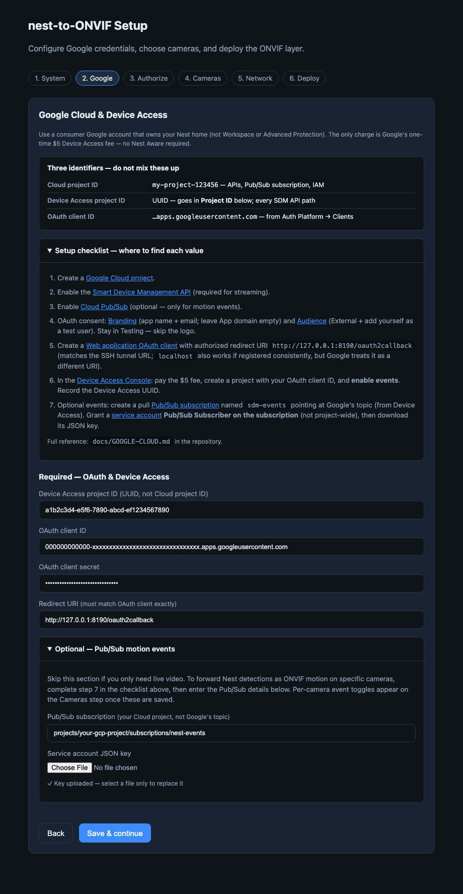
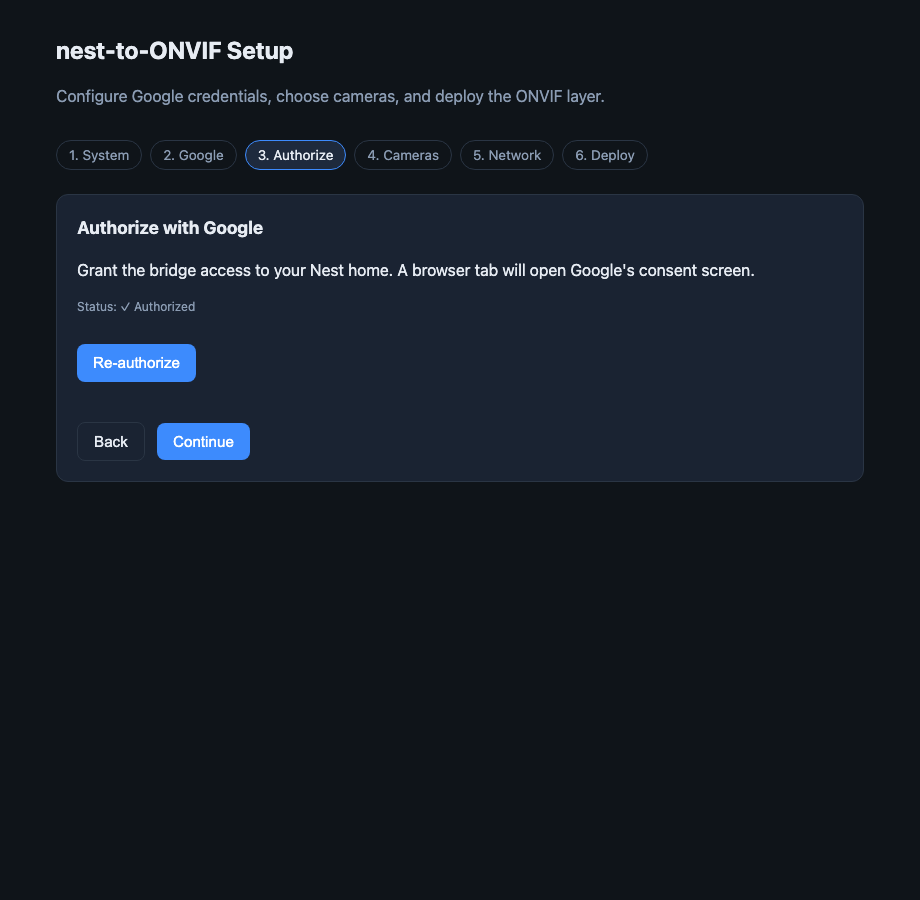
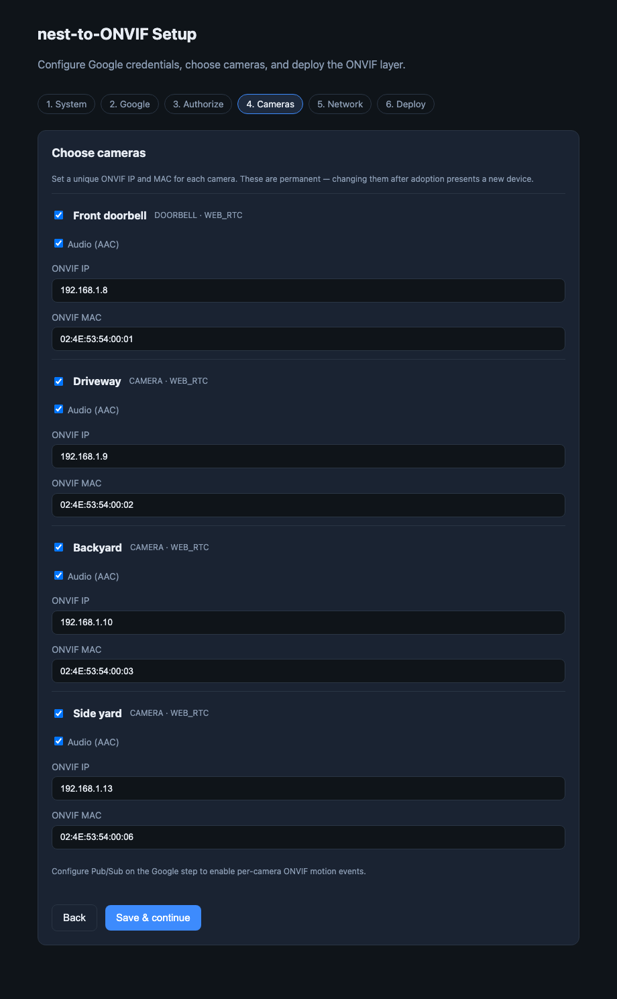
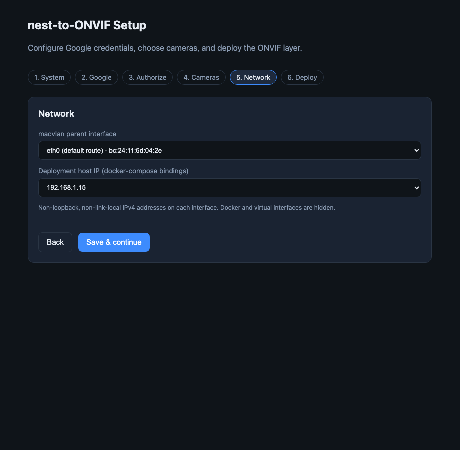
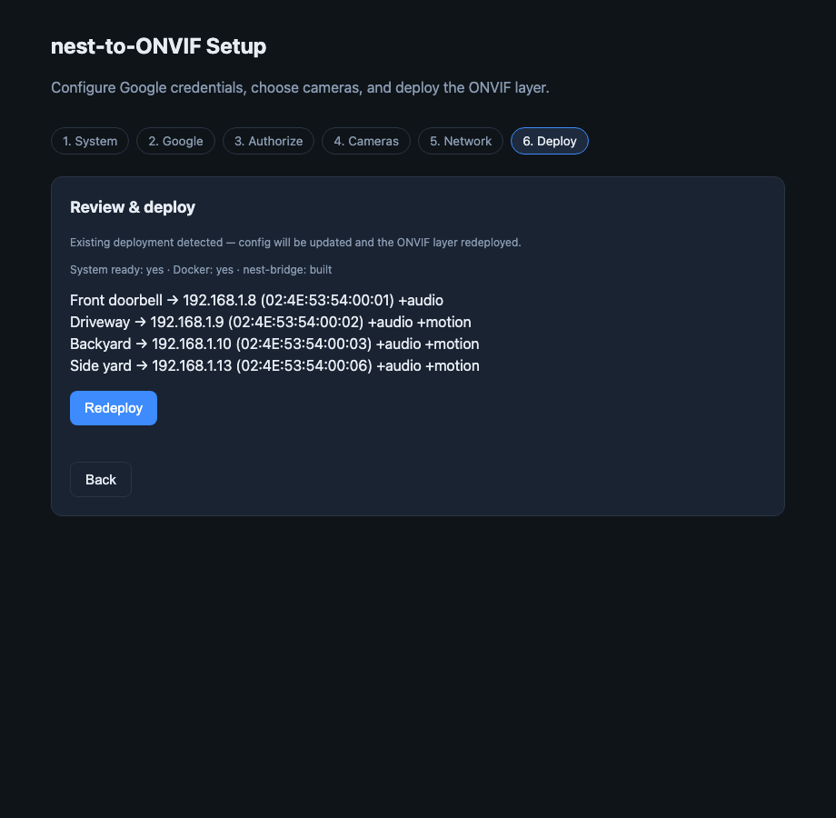

# nest-to-ONVIF setup guide

End-to-end: Linux VM → host preparation → Google credentials → setup wizard or manual
deploy → adopt cameras in your NVR.

| Before you start | Doc |
| --- | --- |
| Google Cloud, OAuth, Device Access, Pub/Sub | [`GOOGLE-CLOUD.md`](GOOGLE-CLOUD.md) |
| Optional motion events (`events.onvif`) | [`EVENTS.md`](EVENTS.md) |
| Continuous streaming / camera power | [`STREAMING.md`](STREAMING.md) |
| Client compatibility | [README § compatibility](../README.md#onvif-client-compatibility) |

---

## 1. Deployment VM

The ONVIF layer runs on **Linux** on the same LAN as your recorder. Each Nest camera
needs its own MAC and IP via **macvlan** — not Docker Desktop on macOS/Windows.

**Camera power:** nest-bridge `serve` streams continuously. Only **wire-powered** Nest
cameras are supported (wired doorbell, wired indoor, floodlight, or outdoor models on a
permanent mains adapter). Battery-powered devices are not — see
[`STREAMING.md`](STREAMING.md).

| Concern | Suggestion |
| --- | --- |
| CPU / RAM | 2+ cores, 4 GB (8 GB for many cameras) |
| Disk | 20 GB+ |
| Network | Bridged LAN; static or reserved VM IP |
| OS | Debian 12 or Ubuntu 22.04 / 24.04 LTS |

Reserve one unused IPv4 per Nest camera (e.g. `192.168.1.8`–`.13`) plus the VM host IP
for Docker bindings (`8554`, `8080`, `8888`). Changing a camera's MAC or IP after
adoption presents new hardware to your NVR.

```bash
sudo mkdir -p /opt
sudo git clone https://github.com/ceb3/nest-to-ONVIF.git /opt/nest-bridge
cd /opt/nest-bridge
bin/host-check
sudo bin/install-packages    # if needed
sudo bin/install-docker      # if needed
bin/build-bridge
```

| Script | Purpose |
| --- | --- |
| `bin/host-check` | Same checks as the wizard System step |
| `bin/install-packages` | `iproute2`, `curl`, `python3`, … |
| `bin/install-docker` | Docker Engine + Compose v2 |
| `bin/build-bridge` | `make build` → `bin/nest-bridge` |
| `bin/setup-host` | Deploy dirs, macvlan, optional systemd + `docker compose up` |
| `bin/generate-deploy-configs` | `onvif.yml` + `mediamtx.yml` from `config.yaml` |

One-shot: `sudo bin/setup-host` (add `--up` to start containers after config exists).

---

## 2. Google Cloud and Device Access

Complete OAuth, Device Access ($5), and (if using motion events) Pub/Sub **before**
opening the wizard. Step-by-step console work is in [`GOOGLE-CLOUD.md`](GOOGLE-CLOUD.md).

You will need:

- Device Access **project UUID** → `google.project_id` (not the Cloud project ID)
- OAuth **client ID** and **secret** → `google.client_id` / `google.client_secret`
- Redirect URI `http://127.0.0.1:8190/oauth2callback` (matches SSH tunnel below)

---

## 3. Setup wizard

The wizard listens on **`127.0.0.1:8190`** on the VM only. Forward it from your laptop:

```bash
# VM
cd /opt/nest-bridge && ./bin/nest-bridge setup

# Laptop
ssh -L 8190:127.0.0.1:8190 user@YOUR-VM
# → http://127.0.0.1:8190
```

Progress is saved in `setup-draft.yaml`. Existing `config.yaml` is loaded for redeploy.

| Step | What |
| --- | --- |
| **1. System** | Host checks; links to `bin/` fix scripts |
| **2. Google** | Credentials; checklist links to [`GOOGLE-CLOUD.md`](GOOGLE-CLOUD.md) |
| **3. Authorize** | OAuth → `tokens.json` |
| **4. Cameras** | SDM device list; ONVIF MAC/IP per camera; **audio** and **ONVIF motion events** toggles per camera (events require Pub/Sub on step 2) — wire-powered only |
| **5. Network** | macvlan parent interface; host IP for compose bindings |
| **6. Deploy** | Writes `config.yaml`, generates sidecar configs, `docker compose up` |













**Redeploy:** return to the wizard, change cameras or network, click **Redeploy**.

Persist macvlan across reboots: `sudo bin/setup-systemd && sudo systemctl start nest-onvif-macvlan.service`

---

## 4. Manual path (no wizard)

```bash
cp config.example.yaml config.yaml   # edit google.* and cameras[]
./bin/nest-bridge auth
./bin/nest-bridge devices
bin/generate-deploy-configs
sudo bin/setup-deploy && sudo bin/setup-macvlan
cd deploy && docker compose up -d
```

For `events.onvif` and per-camera `event:` blocks, see [`EVENTS.md`](EVENTS.md) and
[`GOOGLE-CLOUD.md`](GOOGLE-CLOUD.md). Never commit `config.yaml`, `tokens.json`, or
service-account keys.

---

## 5. After deploy

| Service | Role |
| --- | --- |
| **mediamtx** | RTSP, HLS (`:8888`), ffmpeg transcode, snapshots |
| **snapshots** | nginx JPEGs on `:8080` |
| **onvif** | WS-Discovery, profiles, RTSP proxy per camera IP; optional ONVIF Events (three motion topics) |
| **bridge** | `nest-bridge serve`; LAN viewer on `:8090` |

Compose binds MediaMTX/snapshot/HLS ports to the **host IP** and loopback so they do not
claim addresses on camera macvlan interfaces.

### Live view

Open `http://<host-ip>:8090`. The grid is built from `config.yaml` via
`GET /api/cameras` (up to six tiles per page, HLS on port `8888`, per-tile audio when
`audio: true`). Disable with `viewer.listen: "off"`.

### Adoption

Cameras appear as `nest-bridge Nest Virtual Camera`. Adopt by **IP**, then rename in
your client. ONVIF credentials are not validated.

### Diagnostics

```bash
./bin/nest-bridge -for=1h stream "Front Door"   # not while serve uses that camera
NEST_BRIDGE_LOG_LEVEL=debug docker compose up -d bridge   # in deploy/
```
